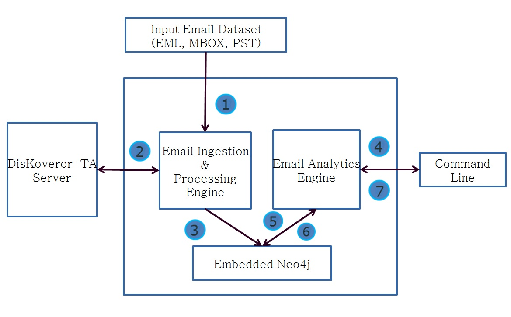

## **Overview**
The Email-Analytics is a framework for analyzing large email datasets. The project is incubated at [Serendio](www.serendio.com). The objective is to process large email datasets and generate useful information out of it. The framework has capability of performing Sentiment Analysis and Topic Extraction on any email dataset with a help of [DisKoveror, The Text Analysis framework](https://github.com/serendio-labs/diskoveror-ta). The Email-Analytics can be run through Command Line Interface.

The possible use case for Email Analytics

    1.  Analyze the email activities of the employees
    2.  Fraud Detection
    3.  Data-mining for Business Analytics

License: GPL 3.0
<!--
## **Key Functionalities**

> 1. **Ingest mailbox**
> 2. **Make Neo4j Graph Database**
> 3. **Auto Indexing**
> 4. **Topic modeling and Sentiment Extraction**
> 5. **Pre-defined Query Support**
-->

## **System Architecture**

#####**1. Input Email Dataset:**
The Email Analytics system currently supports three major Email Formats. They are EML, MBOX and PST. The current email data ingestion is done by providing absolute file/folder path of the email dataset. 
#####**2. Email Ingestion & Processing Engine:**
This module reads raw email document and extract details like CC,BCC,SUBJECT,CONTENTs. It also interact with Diskoveror-TA to get Sentiment Result and Topic Modeling out of email document. It finally pushes the data to Neo4j Database.
#####**3. Email Analytics Engine:**
This part of Email Analytcs system takes queries from user, interact with Neo4j and present the query results.
#####**4. Embedded Neo4j:**
The Email Analytics system stores data into Neo4j Graph Database. The Neo4j can be used either in Embedded mode or with REST API. The current architecture uses Embedded Neo4j. In Embedded mode, we dont need to setup or start neo4j but Neo4j Native Java Library does that job. The database is persisted on local filesytem in specified folder. 
#####**5. DiKoveror-TA Server:**
The Email Analytics system uses DisKoveror-TA for processing Sentiment and Topic Modeling out of email document. The DisKoveror-TA is developed at Serendio and available open source. 
#####**6. Command Line:**
The Email Analytics system takes queries and return results via command line.

## **Getting Started**
#### **Step1: Software Requirements**
#####**Install following softwares:**

    JDK (Version 7 or above)
    Thrift server (Apache Thrift 0.9.2)
    Python (version 2.7.X)
    Pip (version 7.1.X)
    Maven
    
 
**For Ubuntu/Debian Users:**

Install **python-2.7** and **Thrift** using sites:

    https://www.python.org/downloads/    
    http://thrift-tutorial.readthedocs.org/en/latest/installation.html

Install **JDK**, **Pip** and **Maven** from apt package manager:

    sudo apt-get install openjdk-7-jdk
    sudo apt-get install python-pip
    sudo apt-get install maven

    
#### **Step2: Workspace to Download**
Download below packages and extract them.
  > [Email Analysis](https://github.com/serendio-labs/email-analytics/archive/master.zip)

  > [DisKoveror-ta](https://github.com/serendio-labs/diskoveror-ta/archive/master.zip) 
  
  > [Stanford CoreNLP](http://nlp.stanford.edu/software/corenlp.shtml#Download)
  
Download Neo4j-Server Community version and extract it.
  > [Neo4j-Server](http://neo4j.com/download/)

#### **Step3: Package Source Code**
Email Analytics is maven based project. You need to compile and package java class files using maven.  Go to Email Analytics folder and run the command below.

>	    $mvn package

If the packaging is done successful than output jar file should be created in target folder.

#### **Step4: Starting Thrift servers for Sentiment and Topics in DisKoveror-ta**

The requirements.txt file specifies the software packages along with their versions to be installed. Execute the
below command to install all python related dependencies for the Sentiment and Topics.

>     /diskoveror-ta/src/main/python$ sudo pip install -r requirements.txt

Start the thrift servers for Topics and Sentiments 

>     /diskoveror-ta/src/main/python$ python server.py

#### **Step5: Copy the jar file into Email Analytics libs folder**

Add the following jars to your build path

1. Add all jars present in the **_neo4j/lib_** folder of [neo4j](http://neo4j.com/download/) database package to **libs/neo4jlib**

2. Add all jars from [Stanford CoreNLP](http://nlp.stanford.edu/software/corenlp.shtml#Download) Tool package to **libs/stanfordnlp-opennlp/**
 
#### **Step6: Add all jars from Step3 & Step5 to your build path and use them in your java program**
The Email Analytics builds the jar which you can use in your program. The sample code is provided below.
        
        /*Email Ingestion*/
        AppConfigurations conf = new AppConfigurations();
		conf.setNeo4jDbPath("/home/nishant/Desktop/test.db");
		conf.setINPUT_PATH("/home/nishant/Desktop/input");
		conf.setDatasetType(AppConfigurations.EmailDatasetType.EML);
		DatasetIngestionRunner runner = new DatasetIngestionRunner();
		runner.run(conf);

        /*Email Analytics*/
		Neo4jTraversalQuery a = new Neo4jTraversalQuery();
		System.out.println(a.TotalEmailProcessed());
		
## **Using Sample Data**

Sample email dataset files in **_"sample-data"_** folder have been provided for your convenience and can be used to test the project:
>     .pst
>     .mbox
>     .eml
