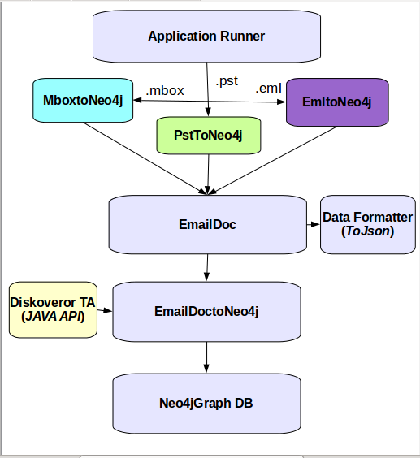
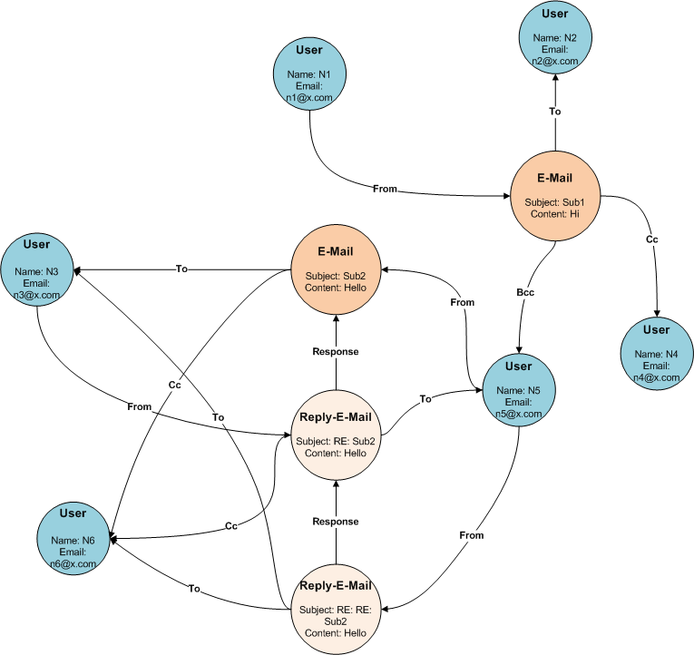

## **Overview**

## **Key Functionalities**

> 1. **Ingest mailbox**
> 2. **Make Neo4j Graph Database**
> 3. **Auto Indexing**
> 4. **Topic modeling and Sentiment Extraction**
> 5. **Pre-defined Query Support**

## **System Architecture**

## **Getting Started**
### **Software Requirements**
    JDK (Version 7 or above)
    Neo4j (version 2.2.X)
    Thrift server (Apache Thrift 0.9.2)
    Python (version 2.7.X)
    Pip (version 7.1.X)
    Maven

##### **_Workspace to Download_**
  > [Email Analysis](https://github.com/serendio-labs/email-analytics/archive/master.zip)

  > [DisKoveror-ta](https://github.com/serendio-labs/diskoveror-ta/archive/master.zip) 

##### **_Starting Thrift servers for Sentiment and Topics in DisKoveror-ta_**

The requirements.txt file specifies the software packages along with their versions to be installed. Execute the
below command to install all python related dependencies for the Sentiment and Topics.

>     /diskoveror-ta/src/main/python$ sudo pip install -r requirements.txt

Start the thrift servers for Topics and Sentiments 

>     /diskoveror-ta/src/main/python$ python server.py

##### **_Package Source Code_**
This is maven based project. You need to compile and package java class files using following command.

>	$mvn package

##### **_Configuring Build Path_**

Add the following jars to your build path

1. Add all the given libraries in **_"libs"_** folder of [Email Analysis](https://github.com/serendio-labs/email-analytics/archive/master.zip)

2. Add all jars present in the **_neo4j/lib_** folder of [neo4j](http://neo4j.com/download/) database package

3. Add all jars from [Stanford CoreNLP](http://nlp.stanford.edu/software/corenlp.shtml#Download) Tool package

4. Add email-analytics jar from target directory
 
##### **_Using Sample Data_**

Sample email data files in **_"Data"_** folder have been provided for your convenience and can be used to test the project:
>     .pst
>     .mbox
>     .eml
